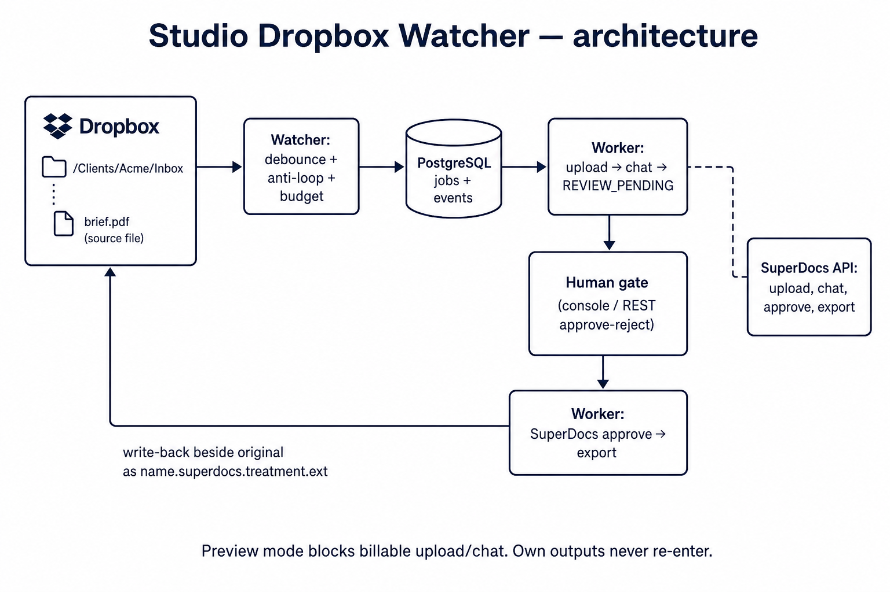

# SuperDocs Dropbox Folder Watcher

Studio / freelancer Dropbox watcher: a client drops a file, SuperDocs treats it, a human gates the diff, the export is filed beside the original. Built for the SuperDocs engineer task (assigned S2 build).

Credit: built by **Shlok Chauhan** for the SuperDocs task.



## What SuperDocs features it uses

REST: upload document, send edit instruction (chat), approve proposed changes, export. Proposed-change content is double-parsed. Preview mode never calls billable upload/chat.

## What it does

- Nominate folders and treatments: **normalize**, **summarize** (companion brief), **respond** (standard response).
- Debounces Dropbox sync so half-written files are not processed.
- Never re-triggers on its own output (name marker + path registry + content hash).
- Client folders cannot be nominated outside that client's Dropbox root.
- Preview mode is a structural no-spend chokepoint (no billable SuperDocs calls).
- Hourly operation budget per folder.
- Console shows what ran, proposed changes, and what needs a human. Approve and reject are first-class API operations (machine-drivable).

## Quick start

```bash
cp backend/.env.template backend/.env
docker-compose up -d --build
docker-compose exec api alembic upgrade head
```

- Console: http://localhost:5173
- API: http://localhost:8001

Fill `DROPBOX_ACCESS_TOKEN` and `SUPERDOCS_API_KEY` for a live loop. Without them, tests still pass and the console can seed a drop for UI review.

## Tests (no live key)

```bash
cd backend
pytest
```

## Formats / domain

Studio documents in a Dropbox shared folder: `.docx`, `.pdf`, and other extensions you allow on the folder config. Second-run proof: a different file in the same nominated folder, not a replay of the first bytes.

Cuts and why: see [NOT_DOING.md](NOT_DOING.md). Architecture: [ARCHITECTURE.md](ARCHITECTURE.md). Submission pack: [SUBMISSION.md](SUBMISSION.md).
