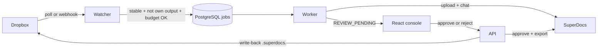

# One-page write-up + architecture (Task 4)

Built for a small studio that already lives in Dropbox. A client drops a file into a nominated folder; SuperDocs applies a treatment (normalize / companion brief / standard response); a human reviews proposed changes in a console; the approved export is filed beside the original with a `.superdocs.` name. Own outputs never re-enter the loop. Preview mode spends nothing.

## Measured (offline, no live keys)

- Backend tests: `pytest` in `backend/` — crash-resume, concurrent claim, anti-loop, debounce, preview $0 spend, hourly budget, path isolation, human gate (prepare does not write back; reject does not write back).
- Clone → run: `docker-compose up -d --build` then `docker-compose exec api alembic upgrade head`. Console at `http://localhost:5173`.
- Stopping rules: content-hash debounce, three-layer anti-loop, `operation_budget_per_hour`, global preview toggle.

## Trade-offs

Polling + optional webhook scan instead of OAuth-per-client. Isolation is path-scoped to each client's Dropbox root, not Dropbox shared-link ACLs (documented in `NOT_DOING.md`). Job-level approve/reject, not per-hunk, because SuperDocs approve is document-level.

## Limitations (honest)

Without Dropbox/SuperDocs tokens, discovery is seeded from the console. Preview jobs never produce a real SuperDocs diff. The assigned build is this watcher; the Task 1 pile-analyst lives in the private `doctask-*` repo.

## Architecture

## Four form answers (draft)

1. **What broke?** First request in a SuperDocs session can stall; proposed-change payloads are JSON strings that need a second parse; large-doc runs sit silent for minutes (still processing). Dropbox fires events on half-written files. Console preview used to be UI-only until wired to a process-level flag.

2. **One morning number:** share of `REVIEW_PENDING` jobs resolved within 24 hours. It is the product: edits that never get gated do not ship.

3. **Next five, in order:** (1) per-client Dropbox OAuth, (2) webhook fast-path as default, (3) item-level reject of individual hunks, (4) Slack ping on review, (5) cost dashboard per folder. Drop: in-app mock-drop once live Dropbox is the demo path. Fix immediately: empty diffs if the second JSON parse regresses.

4. **Self-running ops:** watchers on docs.superdocs.app + GitHub issues; an agent files bugs from the in-app button; CI runs keyless tests; a daily digest of failed jobs and ops spend; humans only approve production schema changes, pricing, and outreach. What breaks first: silent model-quality drift, not infrastructure.

## Video checklist (record this)

1. Watch a folder (two clients if possible). 2. Drop a file. 3. Console shows real proposed changes. 4. Reject one job, approve another. 5. Output appears beside source, named `*.superdocs.*`. 6. Touch the output — no new job. 7. Preview on — no spend, no write-back.
