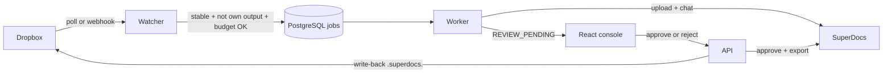

# Architecture — Dropbox folder watcher with write-back

## States

Phase 1: `DISCOVERED → STABILIZING → QUEUED → PROCESSING → REVIEW_PENDING`

Then either `REJECTED` or `APPROVED → EXPORTING → WRITING_BACK → COMPLETED`

## Safety rails

- Content-hash debounce so half-written Dropbox uploads are not processed.
- Three-layer anti-loop: `.superdocs.` name, path registry, content hash.
- Preview mode blocks upload and chat in the SuperDocs client, not only in the UI.
- Hourly `operation_budget_per_hour` per folder.
- Path isolation: a folder must sit under that client’s Dropbox root.
